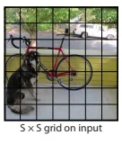

# yolo11

## 图像识别

### 介绍

近年来，随着深度学习的快速发展，卷积神经网络(Convolutional Neural Networks, CNN)在各种计算机视觉任务中取得了非凡的成果。基于CNN的通用算法层出不穷，其中最常用的技术可以被分为双阶段模型(Two-Stage)和单阶段模型(One-Stage)。双阶段模型是先获得感兴趣的区域(the Region of Interest, ROI)，然后对物体进行分类。其中，最具代表性的模型是R-CNN系列(R.Girshick et al,2014)。一阶段模型是端到端策略，在整个过程中只使用一张网络，比双阶段模型更快，但是精度略低。最著名的两种算法是SSD (W.Liu et al, 2016)和我们要介绍的YOLO系列(J.Redmon et al, 2016)。

为了打破两阶段模型(R-CNN系列)算法的检测速度不能满足实时性的僵局，Joseph等人于2016年提出第一代YOLO模型，它检测速度非常快，每秒可以处理45帧图片，能轻松地实时运行。正是因为其速度之快和使用的特殊方法，作者将其取名为：You Only Look Once。

2024 年 9 月 30 日，Ultralytics 在其活动 YOLOVision 中正式发布了 YOLOv11。YOLOv11 是 YOLO 的最新版本，由美国和西班牙的 Ultralytics 团队开发。YOLO 是一种用于基于图像的人工智能的计算机模型。

https://github.com/ultralytics/ultralytics

### 算法步骤

YOLO系列的核心思想就是把目标检测转变为一个回归问题，利用整张图片作为网络的输入，并通过神经网络，得到边界框的位置及其所属的类别。

**(1)划分图像**：YOLO将输入图像划分为一个固定大小的网格。

<figure><figcaption></figcaption></figure>

**(2)预测边界框和类别**：对于每个网络，YOLO预测出固定数量的边界框。每个边界框由5个主要属性描述：边界框的中心坐标(x,y)宽(w)高(h)和边界框包含的目标的置信度(confidence)。此外，每个边界框还预测目标的类别信息，记为C类。

<figure><figcaption></figcaption></figure>

**(3)单次前向传递**：YOLO通过一个卷积神经网络(CNN)进行单次前向传递，同时预测所有边界框的位置和类别。相比于其他目标检测算法，如基于滑动窗口或区域提议的方法，YOLO具有更快的速度，因为它只需要一次前向传递即可完成预测。

<figure><figcaption></figcaption></figure>

**(4)损失函数**：YOLO使用多任务损失函数来训练网络。该损失函数包括位置损失、置信度损失和类别损失。位置损失衡量预测边界框和真实边界框之间的位置差异。置信度损失衡量边界框是否正确地预测了目标，并惩罚背景框的置信度。类别损失衡量目标类别的预测准确性。

<figure><figcaption></figcaption></figure>

**(5)非最大抑制**(Non-Maximum Suppression, NMS)：在预测的边界框中，可能存在多个相互重叠的框，代表同一个目标。为了消除冗余的边界框，YOLO使用非最大抑制算法，根据置信度和重叠程度筛选出最佳的边界框。

###

### 任务种类

YOLO11 is an AI framework that supports multiple [computer vision](https://www.ultralytics.com/glossary/computer-vision-cv) **tasks**. The framework can be used to perform [detection](https://docs.ultralytics.com/tasks/detect/), [segmentation](https://docs.ultralytics.com/tasks/segment/), [obb](https://docs.ultralytics.com/tasks/obb/), [classification](https://docs.ultralytics.com/tasks/classify/), and [pose](https://docs.ultralytics.com/tasks/pose/) estimation. Each of these tasks has a different objective and use case.

YOLO11是一个支持多种[计算机视觉](https://www.ultralytics.com/glossary/computer-vision-cv)**任务**的AI框架。该框架可用于执行[检测](https://docs.ultralytics.com/tasks/detect/)、[分割](https://docs.ultralytics.com/tasks/segment/)、 [obb](https://docs.ultralytics.com/tasks/obb/) 、[分类](https://docs.ultralytics.com/tasks/classify/)和[姿态](https://docs.ultralytics.com/tasks/pose/)估计。这些任务中的每一个都有不同的目标和用例。

（1） Object Detection 物体检测

<figure><figcaption></figcaption></figure>

[对象检测](https://www.ultralytics.com/glossary/object-detection)是一项涉及识别图像或视频流中对象的位置和类别的任务。对象检测器的输出是一组包围图像中对象的边界框，以及每个框的类标签和置信度分数。当您需要识别场景中感兴趣的对象，但不需要知道对象的确切位置或其确切形状时，对象检测是一个不错的选择。

（2）Instance Segmentation 实例分割

<figure><figcaption></figcaption></figure>


[实例分割](https://www.ultralytics.com/glossary/instance-segmentation)比对象检测更进一步，涉及识别图像中的单个对象并将它们与图像的其余部分分割。

对象检测通过在图像周围绘制边界框来识别和定位图像中的对象，而实例分割不仅可以识别边界框，还可以描绘每个对象的确切形状。 YOLO11 实例分割模型提供了勾勒出每个检测到的对象轮廓的掩模或轮廓，这对于了解对象的精确形状很重要的任务（例如医学成像或自动驾驶）特别有用。

（3）Image Classification 图像分类

[图像分类](https://www.ultralytics.com/glossary/image-classification)是三个任务中最简单的一个，涉及将整个图像分类为一组预定义的类别之一。

（4）Pose Estimation 姿势估计

<figure><figcaption></figcaption></figure>

姿势估计是一项涉及识别图像中特定点（通常称为关键点）位置的任务。关键点可以表示对象的各个部分，例如关节、地标或其他独特特征。关键点的位置通常表示为一组 2D `[x, y]`或 3D `[x, y, visible]`坐标。

在默认的YOLO11姿势模型中，有17个关键点，每个关键点代表人体的不同部分。以下是每个索引到其各自身体关节的映射：

0: Nose 1: Left Eye 2: Right Eye 3: Left Ear 4: Right Ear 5: Left Shoulder 6: Right Shoulder 7: Left Elbow 8: Right Elbow 9: Left Wrist 10: Right Wrist 11: Left Hip 12: Right Hip 13: Left Knee 14: Right Knee 15: Left Ankle 16: Right Ankle 0：鼻子 1：左眼 2：右眼 3：左耳 4：右耳 5：左肩 6：右肩 7：左肘 8：右肘 9：左手腕 10：右手腕 11：左臀部 12：右髋部 13：左膝 14：右膝 15：左脚踝 16：右脚踝

（5）Oriented Bounding Boxes [Object Detection](https://www.ultralytics.com/glossary/object-detection) 定向边界框[对象检测](https://www.ultralytics.com/glossary/object-detection)

定向对象检测比对象检测更进一步，引入了额外的角度来更准确地定位图像中的对象。

定向对象检测器的输出是一组旋转的边界框，精确包围图像中的对象，以及每个框的类标签和置信度分数。当您需要识别场景中感兴趣的对象，但不需要知道对象的确切位置或其确切形状时，对象检测是一个不错的选择。

### 实战

#### (1) Predice 【识别图片中的物体】

ultralytics 框架本身给我们提供了一个命令行工具，我们可以用来进行图像识别，只需要一行命令就能识别出图片中的物品：

```sh
// pip install ultralytics

yolo detect predict model=yolo11n.pt source='https://ultralytics.com/images/bus.jpg'
```

<figure><figcaption><p>原始图片</p></figcaption></figure>

<figure><figcaption><p>预测后图片</p></figcaption></figure>

(2)Train 【训练自己的模型】

官方给的模型仅仅只能识别几十种物品，如果你想识别特定类别的物品，就要自己训练了，提前准备好数据后，也是一行命令：

```sh
// data 参数需要指定训练需要的图片集
// 图片集需要排列成正确的结构，如下
dataset/
|- data.yaml
├── train/
│   ├── images/
│   └── labels/
└── val/
    ├── images/
    └── labels/

// data.yaml 中需要指定路径和分类,如下：

############### data.yaml 示例文件 ####################
// train: C:/x/images
// val: C:/xx/images
// test: C:/xxx/images

// nc: 5
// names: ['0-human', '1-wheelchair', '2-suitcase', '3-stroller', '4-bicycle']
#######################################################

yolo detect train data=datasets/data.yaml model=yolo11n.pt epochs=100 imgsz=640

```

训练模型最好使用 GPU 训练，用 Cpu 的话很慢，训练完会在当前目录 runs/detect/trains 文件夹下生成 模型，下次用来预测的时候指定该模型即可。

如果你没有本地环境，或者觉得安装 python 依赖比较麻烦，可以参考下面教程 ：



(2) 检测行人摔倒

识别视频中人物，当人物宽 > 高时候判定人物摔倒，算法比较简单，仅供学习：

```python
# https://github.com/Tech-Watt/Fall-Detection
import cv2
import cvzone
import math
from ultralytics import YOLO

cap = cv2.VideoCapture('fall.mp4')

model = YOLO('yolov8s.pt')

classnames = []
with open('classes.txt', 'r') as f:
    classnames = f.read().splitlines()


while True:
    ret, frame = cap.read()
    frame = cv2.resize(frame, (980,740))

    results = model(frame)

    for info in results:
        parameters = info.boxes
        for box in parameters:
            x1, y1, x2, y2 = box.xyxy[0]
            x1, y1, x2, y2 = int(x1), int(y1), int(x2), int(y2)
            confidence = box.conf[0]
            class_detect = box.cls[0]
            class_detect = int(class_detect)
            class_detect = classnames[class_detect]
            conf = math.ceil(confidence * 100)


            # implement fall detection using the coordinates x1,y1,x2
            height = y2 - y1
            width = x2 - x1
            threshold  = height - width
                
            # 置信度在 80 以上并且物品是人的时候，框出人
            if conf > 80 and class_detect == 'person':
                cvzone.cornerRect(frame, [x1, y1, width, height], l=30, rt=6)
                cvzone.putTextRect(frame, f'{class_detect}', [x1 + 8, y1 - 12], thickness=2, scale=2)
            # 如果摔倒了，显示 fall detected
            if threshold < 0:
                cvzone.putTextRect(frame, 'Fall Detected', [height, width], thickness=2, scale=2)
            
            else:pass


    cv2.imshow('frame', frame)
    if cv2.waitKey(1) & 0xFF == ord('t'):
        break


cap.release()
cv2.destroyAllWindows()
```

